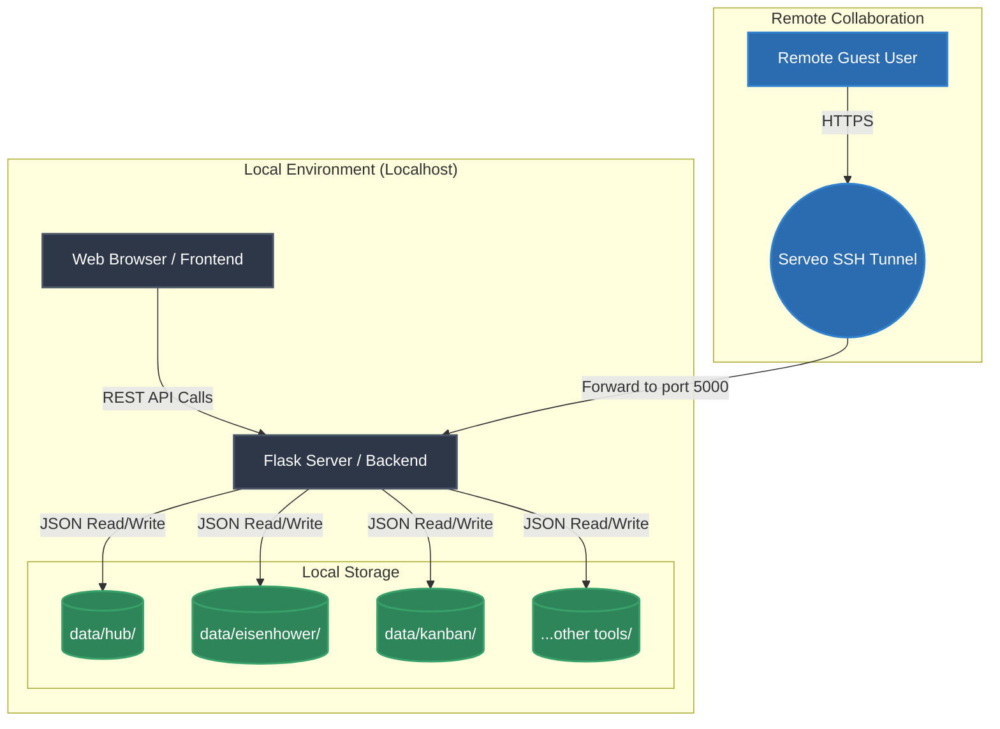
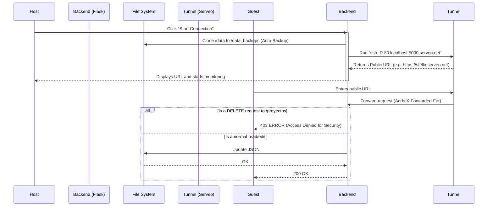

# System Architecture (Stella Rikka)

This document describes the technical architecture of Stella Rikka, data flow, and network topology.

## 1. Overview
Stella Rikka is a **Local-First** application designed to maximize privacy and performance. All persistence logic is handled locally on the user's device, while a modern web interface serves as the client.

### Core Technologies
* **Frontend:** HTML5, CSS3 (Vanilla), JavaScript (ES6+). No heavy frameworks to guarantee instant load times.
* **Backend:** Python 3 (Flask). Serves the REST API and static files.
* **Database:** Flat JSON files managed by Python.
* **Collaboration (Cloud Sharing):** Reverse SSH tunneling via `serveo.net`.

---

## 2. High-Level Architecture Diagram

## 3. Data Flow and Persistence

Stella Rikka does not use traditional relational databases like MySQL or PostgreSQL. To maintain portability, it uses the OS file system.

### Data Structure (Directories)
Each module has its own subdirectory within `backend/data/`.
Example for Kanban:
- `backend/data/kanban/proyectos.json`: Contains board metadata.
- `backend/data/kanban/tareas.json`: Contains individual cards and which project they belong to.

### Exporting and Interoperability (.rikka)
The `.rikka` files are simply structured JSON packages containing all information for a specific project, downloaded directly via a backend API and generated as a `Blob` in the frontend.

---

## 4. Collaboration Tunnel and Security Diagram

The following diagram shows what happens when the user activates the **Collaboration Tunnel** and how the system protects data against deletions (Partial Read-Only) and performs Auto-Backups.

## 5. Interface Design (Sea Horizon)
The Frontend uses a centralized visual architecture. Instead of having redundant CSS files, all modules consume design variables from `css/tema.css` and environment animations defined in the global script `navbar.js`, ensuring that regardless of the module (UML, Diagrams, Hub), the visual experience is cohesive.
