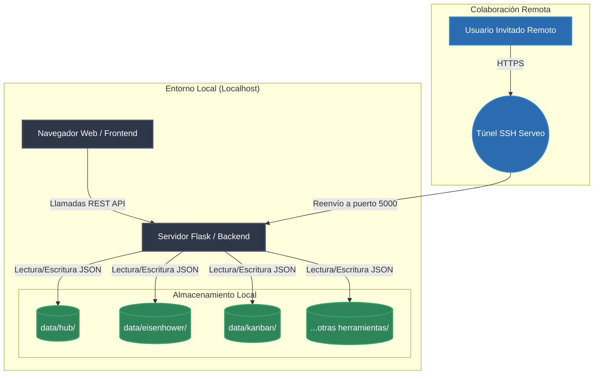
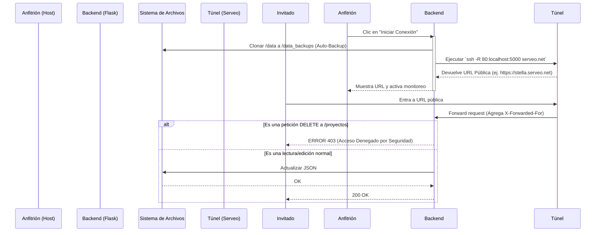

# Arquitectura del Sistema (Stella Rikka)

Este documento describe la arquitectura técnica de Stella Rikka, el flujo de datos y la topología de red.

## 1. Visión General
Stella Rikka es una aplicación **Local-First** diseñada para maximizar la privacidad y el rendimiento. Toda la lógica de persistencia se maneja localmente en el dispositivo del usuario, mientras que una interfaz web moderna sirve como cliente.

### Tecnologías Principales
* **Frontend:** HTML5, CSS3 (Vanilla), JavaScript (ES6+). Sin frameworks pesados para garantizar tiempos de carga instantáneos.
* **Backend:** Python 3 (Flask). Sirve la API REST y los archivos estáticos.
* **Base de Datos:** Archivos JSON planos gestionados por Python.
* **Colaboración (Cloud Sharing):** SSH inverso mediante `serveo.net`.

---

## 2. Diagrama de Arquitectura de Alto Nivel

## 3. Flujo de Datos y Persistencia

Stella Rikka no utiliza bases de datos relacionales tradicionales como MySQL o PostgreSQL. Para mantener la portabilidad, utiliza el sistema de archivos del sistema operativo.

### Estructura de Datos (Directorios)
Cada módulo tiene su propio subdirectorio dentro de `backend/data/`.
Ejemplo para Kanban:
- `backend/data/kanban/proyectos.json`: Contiene la metadata de los tableros.
- `backend/data/kanban/tareas.json`: Contiene las tarjetas individuales y a qué proyecto pertenecen.

### Exportación e Interoperabilidad (.rikka)
Los archivos `.rikka` son simplemente paquetes JSON estructurados que contienen toda la información de un proyecto específico, descargados directamente a través de una API en el backend y generados como un `Blob` en el frontend.

---

## 4. Diagrama del Túnel de Colaboración y Seguridad

El siguiente diagrama muestra qué sucede cuando el usuario activa el **Túnel de Colaboración** y cómo el sistema protege los datos contra eliminaciones (Read-Only Parcial) y realiza Auto-Backups.

## 5. Diseño de Interfaz (Sea Horizon)
El Frontend utiliza una arquitectura visual centralizada. En lugar de tener archivos CSS redundantes, todos los módulos consumen las variables de diseño de `css/tema.css` y las animaciones de entorno definidas en el script global `navbar.js`, garantizando que sin importar el módulo (UML, Diagramas, Hub), la experiencia visual sea cohesiva.
